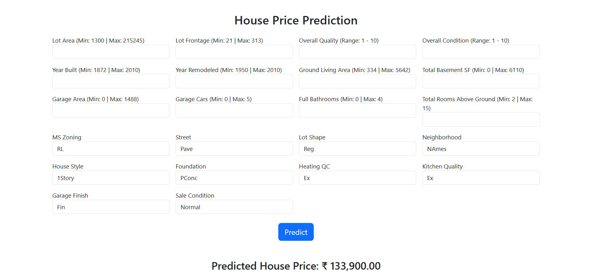

# House_Price_Prediction


## Overview
This project implements a machine learning-based house price prediction system. It analyzes housing data and predicts the price of a house based on their features like Locations (Neighborhood), Year (YearBuilt, YearRemodAdd, GarageYrBlt, YrSold), Condition (Condition1, Condition2, OverallCond, ExterCond, BsmtCond), Quality ( OverallQual, ExterQual, BsmtQual, KitchenQual) and Target variable `SalePrice`. The solution includes End-to-end data preprocessing pipeline, Feature engineering, Model training and evaluation, Web deployment using Flask and Bootstrap.


## Project Structure
```
House_Price_Prediction/
│
├── app.py                          # Flask application
├── House_Price_Prediction.ipynb    # Model training notebook
├── House_Price_Prediction.csv      # Dataset
├── House_Price_Prediction.pkl      # Trained model
├── templates/
│   └── index.html                 # Frontend UI
├── deployment.png                 # App preview
├── requirements.txt               # Requirements
├── setup.py                       # Package Installation
└── README.md
```


## Installation
```
git clone https://github.com/ujjwalkumar14b/House_Price_Prediction.git
cd House_Price_Prediction
pip install -r requirements.txt
python app.py
```


## Machine Learning Pipeline
### 1. Importing Libraires and Data Collection
* NumPy, Pandas
* Matplotlib, Seaborn
* Scikit-Learn
* `train.csv` and `test.csv`

### 2. Data Preprocessing
* Missing value handling using `SimpleImputer`
* Feature scaling using `StandardScaler`
* One-hot encoding for categorical variables

### 3. Models Used
* Linear Regression
* Random Forest Regressor

### 4. Model Evaluation and Final Model Selection 
* MAE, R2 Score
* MSE, RMSE
* The final model is selected based on higher **R2 score**

### 5. Model Deploymwent
* Web Application using HTML, CSS, Bootstrap, Flask
* The application can be deployed on Render,AWS EC2, Heroku (if configured)


## Author
Ujjwal Kumar
GitHub: [https://github.com/ujjwalkumar14b](https://github.com/ujjwalkumar14b)


## License
This project is open-source and available under the MIT License.
